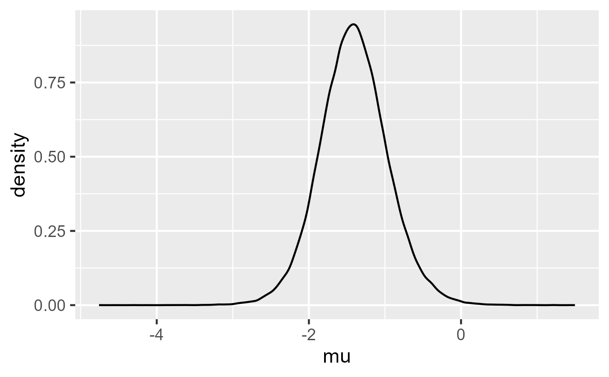

===============
Practical Introduction to Bayesian Parameter Estimation: A Tutorial for NeuroFrogs
===============


---
by Jedidiah Whitridge
---
This tutorial uses the following _R_ packages:

```R
library(tidyverse)
library(BayesFactor)
library(brms)
library(tidybayes)
```

Make sure to install these and load them prior to starting the tutorial!

This guide is intended to be practical and to show you that you - yes, you - can estimate parameters using Bayesian methods. I will briefly cover theoretical concepts where necessary, but my approach throughout this guide will be largely hands-on, as my hope is that you will be able to transfer skills that you learn here to your own research. For this tutorial, I will assume that readers have some baseline knowledge of a number of core concepts. If you are totally unfamiliar with any of the concepts listed below, I have linked free online tutorial resources that you may find helpful as an introduction to these concepts:

[Bayesian reasoning and inference](https://www.lesswrong.com/posts/CMt3ijXYuCynhPWXa/bayes-theorem-illustrated-my-way) and [model comparison using Bayes Factors](https://www.aarondefazio.com/tangentially/?p=90)

[General familiarity with _R_ and RStudio](https://www.dataquest.io/blog/tutorial-getting-started-with-r-and-rstudio/)

[Data wrangling in _R_ using `tidyverse`](https://www.datacamp.com/tutorial/tidyverse-tutorial-r)

[Creating graphics in _R_ with `ggplot2`](https://www.cedricscherer.com/2019/08/05/a-ggplot2-tutorial-for-beautiful-plotting-in-r/)

[Conducting and interpreting linear regression in _R_](https://www.r-bloggers.com/2020/05/step-by-step-guide-on-how-to-build-linear-regression-in-r-with-code/)

Additionally, for information on how to install the `brms` package (as this can be difficult), refer to [this resource](https://learnb4ss.github.io/learnB4SS/articles/install-brms.html).

Note that some of these tutorials may be more exhuastive than necessary with respect to covering assumed background knowledge for this tutorial. Nonetheless, they are all useful resources. 

With all that out of the way, let's get started. 

---
Part I: Why parameter estimation?
---

Assuming you are at least slightly familiar with Bayesian inference, you are probably familiar with Bayes Factors. Bayes Factors are an intuitive and easily interpretable alternative to approaches that our statistics courses have taught us to distrust, like null hypothesis significance testing. So why would we want to use paramater estimation? The output of regression models is messy and more difficult to interpet. Can't we just stick with model comparison using Bayes Factors? 

In some cases, we can. However, we might run into some problems in other cases, such as when we want to use custom priors. Although the `BayesFactor` package allows for priors, you are pretty limited in what you can do with them. If you wanted to use priors resembling anything other than a Cauchy distribution, you're pretty well out of luck. Further, what if you wanted to apply different priors to different model terms? This is common, and it will not be easy - and in some cases, it will not be possible - using `BayesFactor`. 

Finally, and perhaps most importantly, what about all of the uncertainty in our data? Often, at least part of our motivation to take a Bayesian approach to statistics is that we don't want our inferences to boil down to just a _p_- value. Like _p_-values, Bayes Factors don't do the best job quantifying the uncertainty surround our estimates (for more info, see [this blog](https://daniellakens.blogspot.com/2016/07/dance-of-bayes-factors.html)). In the Frequentist world, there has been a general movement towards emphasis on confidence intervals over _p_-values to avoid some of the problems that have led to the replication crisis we currently find ourselves in. If we want to take a comparable, Bayesian approach, we must use parameter estimation. Accordingly, we should get started and learn how to do it.

Let's start off gently by working through a simple example. In this vignette, you will estimate a parameter using Bayes' Theorem, which you should already be familiar with. To set the scene, imagine that you have a jar full of marbles. You can see into the jar and can therefore determine that there are two colors of marbles in there: Red and black. However, you don't know how many marbles there are in total, nor do you how many of each color there are. Based on this, how would you figure out the probability of drawing a black marble from the jar? Not the most practical example, of course - if we really wanted to know that badly, we could just dump out the jar and count up the marbles. However, it works well for the purposes of this demonstration, so we'll stick with it for now.

In this case, our unobserved _parameter_ is the probability of drawing a black marble from the jar. So how do we figure out what it is? To address our question, we could start by taking a sample from the jar. Let's say that we do that by drawing 10 marbles from the jar, and that we observe 7 black marbles and 3 red marbles. Now we have some data to answer our question. Based on this sample, we might say that the probability of drawing a black marble is around 70%, given that's what we see in our data. 

It's a reasonable conclusion to draw, but surely we're not certain of this. We only took a small sample from a larger population of marbles, which is of an unknown size. There are plenty of other probabilities that are possible - we could have obtained the same result by chance if the probability was 50%, 90%, 10%, etc. 

To start addressing this problem, let's figure out the _likelihood_ of our data given possible values for our unobserved parameter (i.e., the probability of drawing a black marble). You should be familiar with the _likelihood_ in the context of Bayesian inference. We're going to be working with that here, too. However, you might be familiar with Bayes' Theorem only as it pertains to discrete values. Here, we're going to expand that approach by mapping out the components of Bayes' Theorem along a continuum. Let's do that.

We'll start by mapping out a number of potential values for our unobserved parameter, or _theta_ values. We can do that like this:

```R
theta <- seq(0, 1, length.out = 100)
```

And if you view the `theta` variable:

Output:

```R
  [1] 0.00000000 0.01010101 0.02020202 0.03030303 0.04040404 0.05050505 0.06060606 0.07070707 0.08080808 0.09090909
 [11] 0.10101010 0.11111111 0.12121212 0.13131313 0.14141414 0.15151515 0.16161616 0.17171717 0.18181818 0.19191919
 [21] 0.20202020 0.21212121 0.22222222 0.23232323 0.24242424 0.25252525 0.26262626 0.27272727 0.28282828 0.29292929
 [31] 0.30303030 0.31313131 0.32323232 0.33333333 0.34343434 0.35353535 0.36363636 0.37373737 0.38383838 0.39393939
 [41] 0.40404040 0.41414141 0.42424242 0.43434343 0.44444444 0.45454545 0.46464646 0.47474747 0.48484848 0.49494949
 [51] 0.50505051 0.51515152 0.52525253 0.53535354 0.54545455 0.55555556 0.56565657 0.57575758 0.58585859 0.59595960
 [61] 0.60606061 0.61616162 0.62626263 0.63636364 0.64646465 0.65656566 0.66666667 0.67676768 0.68686869 0.69696970
 [71] 0.70707071 0.71717172 0.72727273 0.73737374 0.74747475 0.75757576 0.76767677 0.77777778 0.78787879 0.79797980
 [81] 0.80808081 0.81818182 0.82828283 0.83838384 0.84848485 0.85858586 0.86868687 0.87878788 0.88888889 0.89898990
 [91] 0.90909091 0.91919192 0.92929293 0.93939394 0.94949495 0.95959596 0.96969697 0.97979798 0.98989899 1.00000000
```

This gives us a sequence of probabilities between zero and 1. In our case, we went from 0 to 100. That's because 100 is a nice, round number that is easy to think about, but we could create a larger or smaller sequence if we wanted to - we're dealing with probabilities, so we could divide the sequence up infinitely, if we wanted to. 

Given what you know about Bayes' Theorem, this should actually resemble model comparison. Our `theta` values represent values that our unobserved parameter of interest (i.e., the probability of drawing a black marble) could potentially take on, as I said above. In other words, we are mapping out 100 potential _models_ of the data. So, now that we have a continuum of models, we can map the likelihood of the data given each possible probability of our unobserved parameter, like so:

```R
lik <- dbinom(x = 7, prob = theta, size = 10)
```

And if you view the `lik` variable:

```R
  [1] 0.000000e+00 1.248842e-12 1.550081e-10 2.567390e-09 1.863889e-08 8.609995e-08 2.987699e-07 8.509011e-07
  [9] 2.096927e-06 4.626519e-06 9.354042e-06 1.762082e-05 3.130803e-05 5.295758e-05 8.589786e-05 1.343711e-04
 [17] 2.036589e-04 3.002018e-04 4.317098e-04 6.072597e-04 8.373761e-04 1.134092e-03 1.510985e-03 1.983193e-03
 [25] 2.567390e-03 3.281743e-03 4.145828e-03 5.180517e-03 6.407824e-03 7.850719e-03 9.532907e-03 1.147857e-02
 [33] 1.371209e-02 1.625768e-02 1.913911e-02 2.237925e-02 2.599971e-02 3.002040e-02 3.445910e-02 3.933103e-02
 [41] 4.464834e-02 5.041970e-02 5.664987e-02 6.333920e-02 7.048328e-02 7.807252e-02 8.609179e-02 9.452014e-02
 [49] 1.033305e-01 1.124895e-01 1.219572e-01 1.316874e-01 1.416271e-01 1.517169e-01 1.618912e-01 1.720783e-01
 [57] 1.822010e-01 1.921769e-01 2.019188e-01 2.113359e-01 2.203342e-01 2.288173e-01 2.366880e-01 2.438488e-01
 [65] 2.502034e-01 2.556581e-01 2.601229e-01 2.635135e-01 2.657521e-01 2.667698e-01 2.665076e-01 2.649182e-01
 [73] 2.619679e-01 2.576377e-01 2.519251e-01 2.448454e-01 2.364329e-01 2.267422e-01 2.158487e-01 2.038492e-01
 [81] 1.908622e-01 1.770280e-01 1.625074e-01 1.474809e-01 1.321472e-01 1.167202e-01 1.014258e-01 8.649835e-02
 [89] 7.217488e-02 5.868936e-02 4.626519e-02 3.510662e-02 2.538857e-02 1.724502e-02 1.075559e-02 5.930271e-03
 [97] 2.692103e-03 8.576724e-04 1.151892e-04 0.000000e+00
```

Here, we used the density function of the binomial distribution - because our data deals with a binary outcome, either black or not black - to get the likelihood of each potential value. That sounds very abstract, so let's make it concrete by visualizing it:

```R
plot(theta, lik, type = 'l')
```

Output:


_Note: I used `ggplot2` here to do some fancier things, like putting a line where the likelihood is the highest. However, for the purposes of an example like this, it's easier to visualize simple things like this using base `R` graphics._

This makes it much easier to understand. For each probability, we have a likelihood, as indicated by the density of the curve: The more likely values for our unobserved parameter occur at the denser regions of the distribution. As we can see, the highest - or maximum - likelihood occurs at exactly 0.7. This would thereby produce similar inferences to what we concluded based on our sample: Given our data, the most likely value of our unobserved parameter - that is, the probability of drawing a black marble from the jar - is 70%. However, look at all the uncertainty within this distribution. Based on the density, it looks like values ranging from ~0.5 to 0.8 are still plenty likely. 

Now, we've mapped out our beliefs about the likelihood of each `theta` value along a continuum. Using this, we could take a better stab at solving the problem by trying to incorporate some prior knowledge. Again, you should be generally familiar with priors in the context Bayesian inference, although you might be used to working with discrete values, as with the likelihood. 

In our case, we could come up with some priors by simply inspecting our jar of marbles - this is the whole population we are concerned with, after all. Let's say we do this, and based on what we can see, it seems the proportion of black and red marbles appears approximately equal. However, there are a lot of marbles in there, so we're not totally sure. Thus, likelihood aside, our prior beliefs might be that the probability of drawing a black marble from the jar is around 50%, give or take - we think it might a little bit lower, or a little bit higher. 

This gives a prior for potential values of our unobserved parameter. But if you're used to dealing with discrete priors, our uncertainty might seem a bit confusing. However, this is the form priors often take in the real world: We can come up with a reasonable range of values within which we expect a parameter to fall, but there will always be some uncertainty in there. Fortunately, it's quite easy to translate this into something practical that we can work with. All we have to do is map out our priors along a continuum (i.e., a _prior distribution_), just like we did with our likelihood:

```R
prior <- dnorm(x = prob, mean = .5, sd = .1)
```

Here, we use the density function of the normal distribution to conceptualize our priors as a normal distribution with a mean of 0.5 - reflecting our belief that the probability of drawing a black marble is approximately 50% - but also with a standard deviation of 0.1, reflecting our uncertainty and willingness to accept values that are a bit higher and a bit lower. Let's visualize this next to our likelihood:

```R
lines(theta, dnorm(x = theta, mean = .5, sd = .1)/15, col = 'red')
```

Output:


Makes sense, right? 

Now we've got both a likelihood distribution and a prior distribution - that means we have all the ingredients we need to solve Bayes' Theorem. Previously, you've probably done this with discrete values, but it is no different working with distributions. Fortunately, `R` can do all the hard math on the distributions for us - this would be irritating to do by hand. We're still going to calculate a posterior using the priors and the likelihood, but this time it will take the form of a posterior _distribution_. The formula is the same, so let's try it.

First we calculate the marginal likelihood:

```R
marg = sum(prior*lik)
```

Then we can calculate the standardized posterior distribution:

```R
post = (prior*lik)/marg
```

And finally, plot the standardized posterior:

```R
lines(theta, post, 
      col = "blue")
```

Output:


Now we can see it. The reason the posterior distribution is all the way down there is because we've standardized it by dividing by the marginal likelihood. This ensures that all the probabilties in there will sum up to one, which is what we want. As you can see, the posterior is sort of a compromise between the prior and the likelihood, falling in between the two distributions we used to calculate it. But you'd know this, anyway, from previously learning about Bayes' theorem. 

So, now we have a posterior distribution. So what? Well, for one thing, you've now successfully estimated a parameter using Bayesian inference - way to go! We've mapped out a distribution of our beliefs - using our likelihood and prior distributions - about the potential values of our unobserved parameter of interest, the probability of drawing a black marble from the jar. This distribution thereby provides an _estimate_ for our parameter. 

So, what can we do with it? To start, we can see that the highest probability density is around 0.55 or so. Thus, given our prior knowledge and given our data, the the most likely value of our parameter is somewhere around 55%. Fascinating! But you can do a bit more with it, because it is a distribution. For example, what if we wanted to know _how_ likely it is that the probability of drawing a black marble is greater than 50%? We could calculate this easily, like so:

```R
sum(post[theta > .5])
```

Output:

```R
[1] 0.753321
```

The line of code we used gives us the sum of all the posterior probability within the region that we specified. So, in this case, we summed all the posterior probability that exists for probabilities of drawing a black marble above 50%. Pretty neat, right? This suggests that we're pretty confident (75.3% confident, to be precise) that the probability of drawing a black marble is higher than 50%. We could ask more specific questions of the distribution, too. For example, how likely is it that the probability of drawing a black marble falls between 50% and 70%? We could check, like this:

```R
sum(post[theta > .5 & theta < .7])
```

Output:

```R
0.7100376
```

We're pretty flexible in what we can do with posterior distributions. With more complex models, we can do even more interesting things. 

Hopefully this gives you a general idea of what's going on with respect to parameter estimation, as well why it is useful. Mapping out all of our beliefs as distributions - rather than discrete values - helps us incoporate and quantify all that uncertainty we see in the data, which is quite valuable. Now that we've gone over the basic concept, let's work through a more complex - but also more practical - example of what we can do with parameter estimation. 

---
Part II: Parameter estimation using _BayesFactor_
---

You should be familiar with model comparison using Bayes Factors - there is a resource linked at the top of this blog post, if not. Model comparison approaches using Bayes Factors certainly have their place, but they are suited to different kinds of questions compared to the questions you might use parameter estimation to answer. For example, a good question to answer with model comparison could be something like this: 

"Is there a difference between conditions/groups?" 

Let's try and answer this question as it pertains to the built-in `sleep` dataset. If you're unfamiliar with this dataset, I recommend taking a look at the documentation for it. You can do that like this:

```R
?sleep
```

Any time you're working with built-in datasets, this is good to check. In the case of this dataset, for example, the documentation tells us that it is paired, despite the fact that we have a grouping variable named `group`. Good luck figuring that one out on your own! Now, onto answering our question.

First, we assign the built-in dataset to a variable so we can modify it and recover the original if necesssary:

```R
d <- sleep
```

Next, let's conduct a Bayes Factor t-test using the `ttestBF` function from the `BayesFactor` package. For this example, we'll compare the extra hours of sleep that each condition receieved.

```R
ttestBF(d[d$group == 1,]$extra,
        d[d$group == 2,]$extra,
        paired = TRUE,
        data = d)
```

Output:

```R
Bayes factor analysis
--------------
[1] Alt., r=0.707 : 17.25888 ±0%

Against denominator:
  Null, mu = 0 
---
Bayes factor type: BFoneSample, JZS
```

According to our trusty rules of thumb, the evidence here is pretty solid: A difference between groups is favored over a null model by a factor of about 17. Simple and intuitive. But what if we had a slightly more nuanced question about the data - perhaps something like this:

"_What_ is the difference between conditions?" 

We could answer this using parameter estimation. To do so, we'll have to create a posterior distribution we can work with, i.e., estimating the parameter corresponding to the difference between conditions. For a simple design, like this, it's possible to estimate parameters with the `BayesFactor` package. To start off slow, let's stick with this package for now. 

To estimate this parameter, all we have to do is specify our call to `ttestBF` a little bit differently. Here's the code:

```R
set.seed(999)

sleep.post <- ttestBF(d[d$group == 1,]$extra,
                     d[d$group == 2,]$extra,
                     paired = TRUE,
                     posterior = TRUE,
                     iterations = 1e5,
                     data = d)
```

What did we do here? Let's break it down. Essentially, we conducted the same test as before. Under the hood, the `ttestBF` function is using a posterior distribution to come up with the Bayes Factor you see. This time, we told the function to draw _samples_ from this distribution - 10000 of them, to be precise - in order to create a posterior distribution that we can work with. Why do we do this? Resources like [this one](https://xcelab.net/rm/statistical-rethinking/) can explain far better than I, but the gist of it is this: For any somewhat complex model (i.e., the types of models you encounter when dealing with real data), it becomes impossible to solve Bayes' Theorem in a closed-form manner. As a solution to this, we can _approximate_ the posterior distribution, rather than solving for it, by drawing samples. This happens iteratively, using a random sampling algorithm that is far too complex to discuss here (if you're interested in learning more, you could check out [this blog post](https://twiecki.io/blog/2015/11/10/mcmc-sampling/). For the purposes of this tutorial, we'll leave it at that.  

Because this sampling process is random, I included a call to `set.seed()` in the code above to ensure your answers would match mine here. If you exclude this function, you will get slightly different answers. However, because we are taking a lot of samples from the posterior, our approximations of the posterior - and thereby our answers - should be pretty close. In order to reduce this sort of simulation error, you should always be working with a large number of posterior samples to draw trustworthy conclusions from the data: The more samples you have, the better the representation of the distribution should be. 

With that in mind, we've successfully generated and saved a posterior distribution in the `sleep.post` variable. Let's take a look at it:

```R
head(sleep.post)
```

Output:

```R
Markov Chain Monte Carlo (MCMC) output:
Start = 1 
End = 7 
Thinning interval = 1 
            mu      sig2      delta         g
[1,] -1.630122 2.9337786 -0.9517138 0.1575195
[2,] -1.206233 1.5606834 -0.9655476 0.5256748
[3,] -1.861915 1.8127548 -1.3828983 4.7538352
[4,] -1.474748 0.9622143 -1.5034260 0.6653339
[5,] -1.049121 1.3211610 -0.9127415 1.7021058
[6,] -1.265170 1.8386865 -0.9330288 5.1908654
[7,] -1.277349 2.6216533 -0.7889002 0.8153779
```

There's a lot going on there. For the purposes of this tutorial, we're going to ignore most of it. The parameter of interest to us is `mu`. This parameter reflects posterior samples - 10000 of them, to be precise - for the unstandardized difference in `extra` between conditions. If you're curious, `sig2` reflects posterior samples for variance and `delta` reflects the same for the standardized difference between conditions. 

To make this more concrete, let's visualize the posterior distribution for our parameter of interest using `ggplot2`:

```R
sleep.post %>%
  as.data.frame() %>% # this makes the data easier to work with using tidyverse
  ggplot(aes(x = mu)) +
  geom_density()
```

You'll get a figure that looks something like this:



Pretty neat! This is our approximation of the posterior distribution for the unstandardized difference between conditions, based on 10000 samples. Thus, we've successfully estimated another parameter. But what does this parameter tell us? How can we use it to answer our original question, i.e., what is the difference between conditions?

Essentially, it tells us how our beliefs about our parameter, `mu`, are distributed: Much like our marble example, the higher the density of a given value, the higher the posterior probability of that value. As we can see, it appears that our posterior density is highest for values of around -1.5 or so, meaning values in this region are the most probable. This should be reflected if we calculate descriptive statistics for `mu`:

```R
mean(sleep.post[,'mu'])

median(sleep.post[,'mu'])
```

Output:

```R
[1] -1.408298

[1] -1.415092
```

That checks out, then: It seems that the most likely values for mu are around -1.4. That gives us some sort of an answer for our original question: The difference between conditions is around -1.4.

But why leave it at that? One of the main advantages of estimating parameters is that your posterior quantifies your _distribution_ of beliefs about the data. Accordingly, a single estimate for `mu` does not necessarily represent this distribution adequately. Looking at our figure, we can see our posterior includes values ranging from below -4 to upwards of 1. That's a lot of uncertainty about the value of `mu`! A mean or median estimate would largely ignore all this, which we want to avoid doing. 

Of course, not all of these extreme values are meaningful. If we look at the tail ends of the distribution, we can see that posterior density - and therefore probability - is quite low. We don't really consider these to be particularly likely values for `mu`, so we shouldn't emphasize them too strongly. But what about values around -2, or around -0.5? The probability of these values is still fairly high, and a single estimate derived from the posterior doesn't really capture this.

Thus, computing a single estimate for `mu` means that we end up ignoring a lot of uncertainty and some fairly probable values. However, if we deal with the full range of values in the posterior, we might overemphasize extreme values that are very unlikely. Thus also wouldn't be a good representation of our beliefs, because we don't have much faith in values near -4 or 1.5. We need a compromise. What's the solution?

One common approach is to compute a _Credible Interval_ (CI), which essentially trims off a portion of the posterior probability corresponding to a given confidence level. For example, a CI with a confidence level of 95% would retain 95% of the posterior probability, whereas a confidence level of 80% would retain 80% of the probability. Simple enough. 

Computing such an interval will provide a more complete representation of the posterior than a single estimate, so long as we choose a sensible region within the posterior to retain, but it also won't emphasize extremely improbable values that exist on either end of the range. Importantly, it will also allow us to make inferences from the posterior, as I will explain later. There are several possible approaches we could take to compute such an interval, but I'll focus on the Highest Posterior Density Interval (HPDI), which contains the highest _density_ region of posterior probability for a given confidence level. For example, the HDPI for a confidence level of 95% would take 95% of the posterior probability where the probability is most dense. In any semi-normal distribution, this should capture the most likely values of the parameter. 

As a side note, the confidence level is entirely arbitrary. Although 95% is a common cutoff, there is no reason this cutoff must be used. We could use 99%, 50%, 89% (because it's a prime number), or any other value that we believe is justified. To keep things simple and straightforward (and because 95% confidence is the default for the `tidybayes` functions we're working with), I'll stick with 95%. Just keep in mind that you don't have to.

With that in mind, let's go back into _R_ and do something concrete. Now that we know what the HDPI is, let's compute this interval for `mu` using the `tidybayes` package:

```R
sleep.post %>%
  as.data.frame() %>%
  median_hdi(mu)
```

Output:

```R
# A tibble: 1 × 6
     mu .lower .upper .width .point .interval
  <dbl>  <dbl>  <dbl>  <dbl> <chr>  <chr>    
1 -1.42  -2.29 -0.501   0.95 median hdi 
```

Our median estimate for `mu` has not changed much. However, we've also computed lower and upper bounds for the HDPI: -2.29 to -0.50. But how does the 95% HDPI far at representing the posterior in a principled manner? Here, I've visualized the interval for you, with the 95% confidence region shaded in blue:


As we can see, the HDPI cuts off all the extreme values that don't fall within our arbitrary confidence region. Thus, this interval provides a pretty good representation of the values in our posterior that we are willing to deem credible. The representation is pretty good. We've cut off ridiculously extreme values, but we've also retained quite a bit of uncertainty. This should fare much better than a measure of central tendency or the full range of the parameter. 

Now that we have a Credible Interval, making inferences about our parameter (`mu`) is easy: 95% of values in our HDPI are below zero, so we are 95% confident that `mu` is negative. To phrase this in terms of the dataset we are working with, we are 95% certain the the difference between condition 1 and condition 2 falls between -2.29 and -0.50. Because our Credible Interval does not contain zero, we can say that the effect of condition on sleep is _credible_; because we are dealing with 95% of the posterior probability, we are 95% sure that the true estimate lies within the region we selected. 

This is intuitive to think about, and it is similar to how people tend to make inferences from frequentist confidence intervals, with one key difference: This interpretation of Bayesian credible intervals is actually _correct_. On the other hand, frequentist CIs tell you that if repeated the experiment many times using random samples drawn from the same target population, those experiments would produce confidence intervals that contain the true estimate 95% of the time (or whatever other confidence level you might be working with). So, the Bayesian interpretation is pretty intuitive and probably fairly in tune with how you think about confidence intervals anyway. If you work with Bayesian models, you can interpret CIs like this all the time!

Now that we've estimated a parameter for `mu`, let's briefly return to the Bayes Factor we computed earlier. The inferences we derived from the Bayes Factor and parameter estimation are the same, in that we have good reason to believe there is a difference between conditions. However, the Bayes Factor did not provide a complete picture of the uncertainty surrounding the effect, and it did not _quantify_ the effect. With parameter estimation, then, we can accomplish things that Bayes Factors cannot. Rather just a ratio of evidence, we were able to quantify the size of the effect - alongside uncertainty - and provide a range of plausible values for our parameter of interest. 

But we can only do so much with the `BayesFactor` package. What if we had a more complicated design? Further, what if we wanted to incorporate prior knowledge into our models? With the `BayesFactor` package, the latter is possible, but options for specifying priors are limited. To address these problems, we must turn to the `brms` package. 

---
Part III: The Basics of Estimating Parameters Using _brms_
---

Although we will work with a more complex design in this section, the basics we learned about working with the posterior still apply here. For our
purposes, let's work with the `ToothGrowth` dataset. Remember, if you don't know the dataset, you better check the help documentation first!

```R
?ToothGrowth
```

We can see that this dataset reflects an experiment wherein the dependent measure the length of odontoblasts (`len`) in guinea pigs. This doesn't feel intuitive, so we'll just pretend this is tooth length. The guinea pigs were administered vitamin C using one of two methods, either ascorbic acid (`VC`) or orange juice (`OJ`). Each guinea pig received vitamin C at one of three possible levels of `dose`, `0.5`, `1.0`, or `2.0`. Thus, the design of the experiment is 2 x 3, with both fixed effects manipulated between-subject; this is perfect for our purposes, because multilevel modelling is beyond the scope of this tutorial. 

Once you've read all that over and understand the design, we can get started. First, we'll assign the `ToothGrowth` dataset to a variable. 

```R
nd <- ToothGrowth
```

So, how would we model this experiment? We can think about it in a pretty similar manner to how we would think about an ANOVA: We have two fixed effects we are interested in, and we are also probably interested in the interaction between them. `brms` uses the same formula syntax as the `lme4` package and most _R_ functions that can be used to fit linear models (e.g., `lm()`). I am assuming that you are familiar with linear regression (a tutorial is linked above, if not), so hopefully none of this sounds too wacky. 

With this in mind, it is fairly easy to translate our design into a formula, like so:

```R
len ~ supp * dose
```

Passed to `brms`, this syntax will model the effect of each predictor (and their interaction) on `len`. Before we do that, however, we should prepare our dataset:
We want dose to be a categorical predictor, not continuous and numeric, so we should convert it into a factor like so:

```R
nd = nd %>%
  mutate(dose = factor(dose))
```

_Now_ we can fit a linear model of the data using `brms`. Here's how the code looks:

```R
m.1 <- brm(len~supp*dose,
           data = nd,
           chains = 4,
           cores = 4)
```

Simple as that! This might take a minute to compile and run. In your case, you can specify the `chains` and `cores` arguments differently, if you know how many cores your computer has. `chains` refers to the sampling chains you are running, with the assumption that you have an independent computer core available to run each chain independently. The nitty gritty of `brms` is beyond the scope of this tutorial, so if you're just getting started and are curious, you chould check out [this article](https://www.jstatsoft.org/article/view/v080i01).

If you're content moving along with me, we've now successfully fit a regression model using `brms`. 

Now let's call the summary function on the output:

```R
summary(m.1)
```

Output:

```R
 Family: gaussian 
  Links: mu = identity; sigma = identity 
Formula: len ~ supp * dose 
   Data: nd (Number of observations: 60) 
  Draws: 4 chains, each with iter = 2000; warmup = 1000; thin = 1;
         total post-warmup draws = 4000

Population-Level Effects: 
             Estimate Est.Error l-95% CI u-95% CI Rhat Bulk_ESS Tail_ESS
Intercept       13.23      1.16    10.98    15.52 1.00     2102     2638
suppVC          -5.22      1.63    -8.38    -1.96 1.00     1972     2676
dose1            9.49      1.66     6.21    12.72 1.00     1989     2189
dose2           12.83      1.64     9.57    16.09 1.00     2400     2817
suppVC:dose1    -0.71      2.36    -5.31     4.11 1.00     1919     2404
suppVC:dose2     5.30      2.31     0.83     9.79 1.00     2185     2825

Family Specific Parameters: 
      Estimate Est.Error l-95% CI u-95% CI Rhat Bulk_ESS Tail_ESS
sigma     3.71      0.37     3.06     4.49 1.00     2993     2784

Draws were sampled using sampling(NUTS). For each parameter, Bulk_ESS
and Tail_ESS are effective sample size measures, and Rhat is the potential
scale reduction factor on split chains (at convergence, Rhat = 1).
```

There's a lot of output there, but it is very similar to the output you would get from a typical linear model. Let's start with the population-level effects. Because our predictors are categorical, the model intercept represents tooth length at our reference level, which is `supp = OJ` and `dose = 0.5`. The model slopes represent changes in tooth length for other levels of our predictors _relative to our reference level_. So, a coefficient of 9.49 for `dose1` means that at levels of `dose = 1` and `supp = VC`, tooth length increased by an average of 9.49 relative to the reference level. See? Simple enough. We also get 95% Credible Intervals for each coefficient. Given that none of these intervals contain 0, it appears that our intercept and all of our slopes are credible. 

We also get plenty of other things. The above resource on `brms` that I linked covers these in detail, and we will largely leave everything besides our estimates alone in this tutorial. But, if you're just slightly curious, the `sigma` parameter represents the model's residual standard deviation. The model also gives us R-hat statistics and effective sample sizes for each parameter; these are indices of model convergence, which we will not worry about in this tutorial. 

The truly powerful thing about fitting models like this is that we can directly access the full posterior for any model term very easily. This can be accomplished using the `as_draws_df` function from the `brms` package. Let's try that and see what we get (there's a lot of rows, so we'll just glimpse it using `head()`:

```R
m.1 %>%
  as_draws_df() %>%
  head()
```

Output:

```R
# A draws_df: 6 iterations, 1 chains, and 9 variables
  b_Intercept b_suppVC b_dose1 b_dose2 b_suppVC:dose1 b_suppVC:dose2 sigma lprior
1          12     -4.6    10.9      13           0.15            5.3   3.6   -5.8
2          14     -6.8     8.0      13           1.57            4.7   3.7   -5.8
3          15     -8.3     8.1      10           2.23            8.7   3.6   -5.8
4          14     -6.1     6.7      10           1.92            7.8   4.0   -5.8
5          15     -7.0     8.0      12           2.58            6.8   3.6   -5.8
6          15     -6.6     6.2      12           3.10            6.2   3.1   -5.8
# ... with 1 more variables
# ... hidden reserved variables {'.chain', '.iteration', '.draw'}
```

All of our model coefficients are here. The values in this dataframe represent samples (or _draws_) from the posterior for each coefficient. This is pretty similar to what we did using `ttestBF`, except now we have done it for a much more complex model. As an aside, we can see in our output from `as_draws_df` that `brms` uses weird naming conventions for model coefficients. If you're not familiar with these conventions, and if you don't want to generate a dataframe every time you need to know what the name of a model term is, the `get_variables` function from the `tidybayes` package is very handy:

```R
get_variables(m.1)
```

Output:

```R
 [1] "b_Intercept"    "b_suppVC"       "b_dose1"        "b_dose2"        "b_suppVC:dose1" "b_suppVC:dose2"
 [7] "sigma"          "lprior"         "lp__"           "accept_stat__"  "stepsize__"     "treedepth__"   
[13] "n_leapfrog__"   "divergent__"    "energy__"  
```

Easy!

Now, to get comfortable working with posteriors from complex models, let's start by trying to calculate some condition means. Although we have a reference level and change scores, we can still derive these quite easily using the posterior. Let's start off simple, by calculating the condition mean for our reference level. In our model, this corresponds to the `supp = OJ` and `dose = 0.5` condition (i.e., our intercept). Remember, to access the posterior for this condition, we will need to use the model intercept, i.e., the `b_Intercept` term. Let's glimpse at the posterior distribution for the intercept by visualizing it:

```R
m.1 %>%
  as_draws_df() %>%
  ggplot(aes(x = b_Intercept)) +
  geom_density() +
  theme_classic()
```

Output:


This is a similar exercise to what we did with our posterior from the sleep dataset, but it's a bit more flexible. As you can see, it's quite simple to calculate a posterior distribution correspond to any given parameter contained within your model! This can be very powerful, as I will demonstrate later.

But for now, what do we know about this parameter (the condition mean) that we are interested in? As we can see, the most probable values of the parameter are around 13 or so, which matches up well with the model output. We can also use `as_draws_df` in conjunction with `median_hdi` from `tidybayes` to calculate a credible interval for any posterior distribution derived from our model:

```R
m.1 %>%
  as_draws_df() %>%
  median_hdi(b_Intercept)
```

Output:

```R
# A tibble: 1 × 6
  b_Intercept .lower .upper .width .point .interval
        <dbl>  <dbl>  <dbl>  <dbl> <chr>  <chr>    
1        13.2   11.1   15.6   0.95 median hdi 
```

This might not seem that exciting, because our `brms` output already gave us a Credible Interval for this term, and it is quite similar to the HDI. However, something slightly more exciting might be to generate an estimate for a condition that was not explicitly presented in our output. For example, let's do this for the `supp = OJ` and `dose = 2` condition. All we have to do to access this posterior is sum up model terms. Because our slopes reflect differences relative to the intercept, we can just add the intercept to the other relevant parameter:

```R
m.1 %>%
  as_draws_df() %>%
  median_hdi(b_Intercept + b_dose2)
```

Output:

```R
# A tibble: 1 × 6
  `b_Intercept + b_dose2` .lower .upper .width .point .interval
                    <dbl>  <dbl>  <dbl>  <dbl> <chr>  <chr>    
1                    26.1   23.8   28.4   0.95 median hdi 
```

And there's our estimate for the `supp = OJ` and `dose = 2` condition! It wasn't in our output, but we can still access it. Pretty intuitive, right? You could access any condition mean this way, very easily. 

Now, something that is perhaps even more exciting is that we can use this general method to conduct any number of arbitrary comparisons between parameters within our model. For example, what if we wanted to check whether tooth length in the `VC` condition was higher for `dose = 2` relative to `dose = 1`? This is very easy to do with `as_draws_df`. Here's a demonstration: 

```R
m.1 %>%
  as_draws_df() %>%
  
  # Remember, the model slopes reflect changes relative to the reference level.
  # To get the mean for a given condition, we need to add the slopes to the intercept
  
  mutate(contrast = (b_Intercept + b_dose2) - (b_Intercept + b_dose1)) %>%
  
  # Then we can compute the desired contrast between conditions and produce a
  # credible interval
  
  select(contrast) %>%
  median_hdi()
```

Output:

```R
# A tibble: 1 × 6
  contrast .lower .upper .width .point .interval
     <dbl>  <dbl>  <dbl>  <dbl> <chr>  <chr>    
1     3.34  0.135   6.56   0.95 median hdi  
```

As we can see, our median estimate is 3.34, with the HDI ranging from 0.14 to 6.56. In other words, tooth length was credibly higher for the `supp = OJ` and `dose = 2` condition relative to the `dose = 1` condition for the same method of delivery. This is what I find most intutitive about working with Bayesian models. When it comes to contrasts, the world is your oyster. You can generate a contrast for any relationship you are interested in - no need for special statistical tests to evaluate pairwise comparisons. 

If you're curious what's actually going on under the hood here, what we're doing is creating a whole distribution of posterior samples - uncertainty and all - corresponding to the _difference_ between parameters that we're interested in. We can see that, and visualize it if we would like, so it is a little bit more accessible:


So, this posterior distribution corresponds to to the difference between the posterior for `supp = OJ` and `dose = 2` and the posterior for `supp = OJ` and `dose = 1`. Once we calculate this distribution, all we do is calculate a credible interval from it, and then we can make inferences. Very simple and very powerful - no need to think about Tukey tests, Bonferroni corrected _p_-values and the like. 

If we wanted to take this a step further, we could translate our contrasts and condition means into informative visualizations. For example, what if we were interested in depicting the contrast between high and medium doses for the `OJ` group (`dose2` - `dose1`, calculated above) and the contrast between high and low doses for the same group (`dose2` - `dose0.5`). We can make a pretty cool plot out of this using the `stat_halfeye` function from `tidybayes`. This function is imported from the `ggdist` package, which you'll want to install if you'll be doing a lot of this sort of visualization. For our purposes, however, the functions `tidybayes` has will suffice. Here's how we could visualize these two contrasts together:

```R
m.1 %>%
  as_draws_df() %>%
  mutate(HighMid = (b_Intercept + b_dose2) - (b_Intercept + b_dose1),
         
         # dose0.5 is our intercept, so the difference between dose2 and
         # dose0.5 is just equal to the slope of dose2
         
         HighLow = b_dose2) %>% 
  
  pivot_longer(cols = c(HighMid, HighLow), 
               names_to = 'contrast', 
               values_to = 'post') %>%
  ggplot(aes(x = post, 
             y = contrast)) +
  stat_halfeye() + 
  theme_classic()
```

Output:


Cool plot, right? It contains a lot of information. The point is your median posterior estimate. The thick line surrounding the point is the 50% HDI, and the thin line is the 95% HDI. On top of the interval, we get a visualization of the entire posterior distribution of the estimate. These contrasts might not be the most interesting to visualize, but it's a simple proof-of-concept that you can build off. 

Now that we understand the basics of fitting models with `brms` and working with the posteriors they generate, let's finally go through a more complex - but more practical - example, using the same dataset.

---
Part IV: A Practical Example
---

You might have noticed that we fit our model of the `ToothGrowth` dataset without specifying any priors. This is not great. When we don't specify priors, `brms` uses default priors. What does this mean, exactly? To understand, we need to take a look at the priors the model used, which we can access using `prior_summary`:

```R
prior_summary(m.1)
```

Output:

```R
                 prior     class         coef group resp dpar nlpar lb ub       source
                (flat)         b                                               default
                (flat)         b        dose1                             (vectorized)
                (flat)         b        dose2                             (vectorized)
                (flat)         b       suppVC                             (vectorized)
                (flat)         b suppVC:dose1                             (vectorized)
                (flat)         b suppVC:dose2                             (vectorized)
 student_t(3, 19.2, 9) Intercept                                               default
    student_t(3, 0, 9)     sigma                                     0         default
```

We can see that by default, `brms` puts "flat" priors on our slopes. These are the priors we will focus on, for now. But what would "flat" priors look like? Something like this:


I've added tails so the "curve" is visible. The values on each axis aren't important. What is important is that all values within the distribution (within the range of -5 to 5, for the purposes of my visualization) have equal probability. So, this is the prior knowledge that `brms` puts on our slopes if we don't specify anything. This is about as uninformative as a prior can get: We are telling the model that any given value of our slopes is just as likely as any other given value. This is also nearly equivalent to the approach taken by Frequentist methods.

It is good not to use priors that are _too_ informative; this could tip the scale one way or the other, which we want to avoid. In practice, however, there is no reason that priors need to be _so_ uninformative as to afford equal probablity to all possible values. What reasonable constraints might we apply to the data?

In this example, our dependent variable is tooth length. The default prior used by `brms` will consider values below zero to be just as likely as values above zero. This makes no sense. A guinea pig could have a tooth length of zero, hypothetically, but lower values are not possible: Guinea pigs cannot have negative teeth. Accordingly, it would be very reasonable of us to tell the model not to consider values below zero. Similarly, the fact that we are working with guinea pigs tells us that we can place some reasonable constraints on how long their teeth can be. Guinea pigs are quite small, so their teeth are not going to be comparable in size to the tusks of an elephant. Using flat priors, we are essentially saying that tusk-sized teeth are just as likely as something more reasonable. We are also saying that negative teeth are just as likely as teeth. That doesn't make any sense.

With that in mind, let's fit a better model that incorporates some reasonable prior knowledge. Before we do that, however, let's modify the parameterization of the model so we can more easily specify priors for each condition. 

Because we are using categorical predictors, we can remove the model intercept and compute slopes that estimate the mean in each condition. Using this approach, our reference level will still be modelled, and the output will be much more intutive to interpret. Rather than thinking about the slopes as differences between conditions, we will instead simply get an estimate for each cell. This will also make contrasts easier to compute. We can remove the model intercept using the same syntax we would use in `lme4`. Here's the formula we'll use:

```R
len~supp:dose-1
```

Now that we have our formula, we can look at the parameterization of the model and decide how we will specify our priors. We can access this easily without fitting a model, using the very handy `get_prior` function from `brms`. If we were fitting a different type of model, we'd need to give it some additional information. But for our purposes, all we need is the formula and the dataframe we're using:

```R
get_prior(formula = len~supp:dose-1,
          data = nd)
```

Output:

```R
              prior class           coef group resp dpar nlpar lb ub       source
             (flat)     b                                                 default
             (flat)     b suppOJ:dose0.5                             (vectorized)
             (flat)     b   suppOJ:dose1                             (vectorized)
             (flat)     b   suppOJ:dose2                             (vectorized)
             (flat)     b suppVC:dose0.5                             (vectorized)
             (flat)     b   suppVC:dose1                             (vectorized)
             (flat)     b   suppVC:dose2                             (vectorized)
 student_t(3, 0, 9) sigma                                       0         default
```

Now we can see all the terms in our model. As we can see, we'll compute a slope corresponding to tooth length for every possible combination of our fixed effects. Pretty intuitive, right? This also means we don't have to specify priors on our slopes with respect to the _difference_ we expect relative to the reference level. Instead, we can specify priors that reflect our belief about what tooth length should be in each condition. This is way easier and more intuitive.

Now, with this parameterization, we could give the model a specific prior for each condition. However, we do want to avoid tipping the scale, so we'll keep our priors pretty general and mostly uninformative. There are two pieces of prior knowledge we want to incorporate here:

1. Tooth length cannot be negative
2. Guinea pig teeth won't be particularly long

To do this, we'll have to come up with a belief about guinea pig tooth length. I'm no expert, but you can pretend I researched this and came up with the principled hypothesis that tooth length in any condition should fall between 0 and 16, with a mean of 8. Much like what we did in the first example, we're mapping out a prior _distribution_ of beliefs. In practice, your priors should be calibrated to principled beliefs. However, I am, unfortunately, not an expert on tooth length in guinea pigs, so what can you do? 

We can specify our prior beliefs as a normal distribution with a mean of 8 and a standard deviation of 4. To keep with the theme of keeping things concrete, I've visualized our prior distribution for us. Here's how it would look, with our plausible range of values shaded in red:


Simple enough to think about, right? The red region is where we're saying we expect average tooth length to fall in any given condition. The tails on either side show that we're allocating some probability to more extreme values, but definitely less than what we're allocating to our plausible range of values. This is a fairly reasonable prior. It's not particular _informative_, in that we're keeping the range of plausible values pretty wide and not allocating _too_ much probability to a narrow range of values. This priors aren't _actually_ principled, because I know nothing about the dependent variable we're working with, but they at least should semi-resemble priors that are. 

We're also going to set a hard lower bound on tooth length in all conditions so the model doesn't afford probability to values below zero, but we can do that in our call to the `brm` function. In `brms`-speak, our priors would look like this:

```R
prior(normal(8, 4), class = 'b', lb = 0)
```

This sets a normal prior - with a mean of 8 and a standard deviation of 4 - on all of our model slopes. If you wanted to set priors on individual model coefficients, you could do it like this:

```R
prior(normal(8, 4), coef = 'suppOJ:dose2')
```

But you would only want to do that if you had good reason to do so. We don't, so we won't do that today.

Another thing we won't get into is addressing the priors for sigma. By default, `brms` uses a half-Cauchy prior, which is a Cauchy distribution truncated at zero. Sigma cannot be negative, so this is good. Half-Cauchy priors are uninformative and are often recommended for sigma. We don't have any principled reason to mess with this prior in this tutorial, so we'll leave it as is.

Now that we've gone over all of that, let's fit a new model, minus the intercept and inclusive of our principled priors on the model slopes. Here's how we could do that:

```R
m.2 <- brm(len~supp:dose-1,
           prior = prior(normal(8, 4), class = 'b', lb = 0),
           data = nd,
           chains = 4,
           cores = 4)
```

And our output:

```R
 Family: gaussian 
  Links: mu = identity; sigma = identity 
Formula: len ~ supp:dose - 1 
   Data: nd (Number of observations: 60) 
  Draws: 4 chains, each with iter = 2000; warmup = 1000; thin = 1;
         total post-warmup draws = 4000

Population-Level Effects: 
               Estimate Est.Error l-95% CI u-95% CI Rhat Bulk_ESS Tail_ESS
suppOJ:dose0.5    12.75      1.21    10.37    15.12 1.00     5051     2749
suppVC:dose0.5     7.95      1.20     5.57    10.28 1.00     5438     2539
suppOJ:dose1      21.41      1.23    18.86    23.72 1.00     5609     2585
suppVC:dose1      16.00      1.18    13.57    18.25 1.00     5436     2978
suppOJ:dose2      24.51      1.21    22.07    26.78 1.00     4986     3050
suppVC:dose2      24.57      1.21    22.07    26.80 1.00     4728     2760

Family Specific Parameters: 
      Estimate Est.Error l-95% CI u-95% CI Rhat Bulk_ESS Tail_ESS
sigma     3.88      0.42     3.16     4.78 1.00     3734     3284

Draws were sampled using sampling(NUTS). For each parameter, Bulk_ESS
and Tail_ESS are effective sample size measures, and Rhat is the potential
scale reduction factor on split chains (at convergence, Rhat = 1).
```

Nice - much easier to interpret than our previous model! You'll also notice that tooth length in our reference level is a bit lower than before. This is because our priors pulled it a little bit closer to zero (i.e., _regularized it_). Once again, we get a 95% Credible Interval for each estimate, but in this case, these are less meaningful. All they tell us is that tooth length in each condition is credibly different from zero, which we would hope it should be (unless we had toothless guinea pigs). 

But the real strengths of this model arise when we want to compute contrasts. The way we have paramterized the model makes this incredibly easy. For example, let's see if tooth length was greater in the `suppOJ:dose1` condition relative to the `suppVC:dose1` condition. Note that I wrap the column names in backticks. _R_ will interpret the `:` as an operator if you don't do this, so this is useful to know if you'll be working with models with crossed effects. Anyway, here's the code:

```R
m.2 %>%
  as_draws_df() %>%
  mutate(contrast = `b_suppOJ:dose1` - `b_suppVC:dose1`) %>%
  median_hdi(contrast)
```

Output:

```R
# A tibble: 1 × 6
  contrast .lower .upper .width .point .interval
     <dbl>  <dbl>  <dbl>  <dbl> <chr>  <chr>    
1     5.40   1.96   8.53   0.95 median hdi 
```

Indeed, it's credibly higher for the former. Let's try something else - what if we wanted to know if average tooth length was higher for the `OJ` group overall relative to the `VC` group? We could check by averaging the lengths for each group and then subtracting one from the other, like this:

```R
m.2 %>%
  as_draws_df() %>%
  mutate(contrast = 
           (`b_suppOJ:dose0.5` + `b_suppOJ:dose1` + `b_suppOJ:dose2`)/3 - 
           (`b_suppVC:dose0.5` + `b_suppVC:dose1` + `b_suppVC:dose2`)/3) %>%
  median_hdi(contrast)
```

Output:

```R
# A tibble: 1 × 6
  contrast .lower .upper .width .point .interval
     <dbl>  <dbl>  <dbl>  <dbl> <chr>  <chr>    
1     3.39   1.58   5.37   0.95 median hdi   
```

Credibly higher for the `OJ` group - analogous to a main effect of group that you would get in an ANOVA. We could do the same thing for levels of dose, if we chose to. It's also easy to check for interaction between the fixed effects, and one appears to be obvious from our model output. We already know that tooth length is higher for the `OJ` relative to the `VC` group at `dose = 1`, so let's compute the contrasts for the other levels of `dose`:

```R
m.2 %>%
  as_draws_df() %>%
  mutate(contrast = `b_suppOJ:dose0.5` - `b_suppVC:dose0.5`) %>%
  median_hdi(contrast)
```

Output: 

```R
# A tibble: 1 × 6
  contrast .lower .upper .width .point .interval
     <dbl>  <dbl>  <dbl>  <dbl> <chr>  <chr>    
1     4.79   1.46   8.25   0.95 median hdi 
```

Same pattern for low doses. What about high doses?

```R
m.2 %>%
  as_draws_df() %>%
  mutate(contrast = `b_suppOJ:dose2` - `b_suppVC:dose2`) %>%
  median_hdi(contrast)
```

Output:

```R
# A tibble: 1 × 6
  contrast .lower .upper .width .point .interval
     <dbl>  <dbl>  <dbl>  <dbl> <chr>  <chr>    
1  -0.0765  -3.40   3.30   0.95 median hdi   
```

Just as I suspected - no credible difference at higher doses. Thus, it seems that `supp` and `dose` interact such that tooth length is higher for the `OJ` group relative to the `VC` group and low and medium doses, but length is similar at high doses. If this study wasn't so mundane, maybe this would be a very interesting finding. 

The reason I've gone through all these arbitrary contrasts is to show you that you can really do whatever you please with the posterior when estimating parameters. This is a verstaile approach and I believe working with posteriors in this manner is about as intuitive as statistics can be, once you get past the more intimidating parts of the code. As a final exercise, let's put together some visualizations of our more complex model. One option would be to plot the estimates for each condition by group. This should do a fairly good job of conveying the pattern of results we observed. Here's how we could do it:

```R
m.2 %>%
  as_draws_df() %>%
  pivot_longer(cols = `b_suppOJ:dose0.5`:`b_suppVC:dose2`,
               names_to = 'Dose',
               values_to = 'Length') %>%
  mutate(Supp = if_else(grepl('VC', Dose), 'VC', 'OJ')) %>%
  mutate(Dose = case_when(grepl('0.5', Dose) ~ 'Low',
                               grepl('1', Dose) ~ 'Mid',
                               grepl('2', Dose) ~ 'High')) %>%
  mutate(Dose = factor(Dose, levels = c('Low', 'Mid', 'High'))) %>%
  ggplot(aes(x = Length, y = Dose, fill = Supp)) +
  stat_halfeye(position = position_dodge(width = 0.9), 
               scale = 0.7, slab_alpha = 1,
               point_interval = median_hdi) +
  scale_fill_brewer(palette = 'Dark2') +
  theme_classic()
```

Which gives you this:


Pretty cool, right? And it's informative, too! You can see the HDI, the full posterior, and the pattern of results is pretty easy to pick out. Of course, there are other ways we could visualize the data. For example, if we thought the `OJ` group would generally have much higher tooth length relative to the `VC` group, we might want to graphically highlight the contrast between levels of `supp` at different levels of `dose`. Hypothetical, of course, but here's how you could do that:

```R
m.2 %>%
  as_draws_df() %>%
  mutate('OJ Low - VC Low' = `b_suppOJ:dose0.5` - `b_suppVC:dose0.5`,
         'OJ Mid - VC Mid' = `b_suppOJ:dose1` - `b_suppVC:dose1`,
         'OJ High - VC High' = `b_suppOJ:dose2` - `b_suppVC:dose2`) %>%
  pivot_longer(cols = `OJ Low - VC Low`:`OJ High - VC High`, 
               names_to = 'Contrast', values_to = 'Length') %>%
  mutate(Contrast = factor(Contrast,
                           levels = c('OJ Low - VC Low',
                                      'OJ Mid - VC Mid',
                                      'OJ High - VC High'))) %>%
  ggplot(aes(x = Length, y = Contrast)) +
  stat_halfeye(slab_fill = 'firebrick4',
               slab_alpha = 0.8, 
               point_interval = median_hdi) + 
  geom_vline(xintercept = 0, linetype = 'dashed') +
  theme_classic()
```

That will give you a plot like this:


Here, I added a line at 0 so it's easy to tell if a contrast is credible or not. If this was the comparison we were interest it, a plot like this would do a pretty good job communicating it. 

Now, as one FINAL exercise - for real, this time, I promise - let's demonstrate the importance of working with _principled_ priors. The priors we placed on our model were not particularly informative, and because of this, they did not have a drastic impact on our model output. However, what if we placed some stronger priors on the model? 

Well, all we'd have to do to make the priors overly informative is to narrow our range of plausible values a bit. We could do this by changing the standard deviation of our prior distribution. Let's cut it in half - we'll say our prior is now a normal distribution with a mean of 8 and a standard deviation of 2. Plus or minus two standard deviations from the mean would give us a range of 4 to 12, which is now the range of plausible values we're willing to accept. You might think that our range hasn't narrowed **that** much, but it really has. Let's take a look at this visualization I made:


In red, we have the reasonable priors we put on the previous model. In blue, we have the priors we're going to put on the absolute disaster of a model that we'll fit in a minute. As you can see, not only has our range of values tightened, but we're also allocating vastly more probability to values near the mean and vastly less to values away from the mean. This is an overly informative prior. It is going to bias our estimates. For an experiment like this, such a prior would almost never be appropriate. This is just a cautionary exercise. 

So, to put the fear of bad statistics into you, let's fit the model again, using our slightly modified prior. Remember, we're fitting a near-indentical model, we're just altering the standard deviation of our prior distribution. Here's the code:

```R
m.3 <- brm(len~supp:dose-1,
           prior = prior(normal(8, 2), class = 'b', lb = 0),
           data = nd,
           chains = 4,
           cores = 4)
```

And we'll wait a minute for this mess to compile and run...

```R
summary(m.3)
```

Output:


```R
 Family: gaussian 
  Links: mu = identity; sigma = identity 
Formula: len ~ supp:dose - 1 
   Data: nd (Number of observations: 60) 
  Draws: 4 chains, each with iter = 2000; warmup = 1000; thin = 1;
         total post-warmup draws = 4000

Population-Level Effects: 
               Estimate Est.Error l-95% CI u-95% CI Rhat Bulk_ESS Tail_ESS
suppOJ:dose0.5     9.56      1.70     6.19    12.95 1.00     4637     2088
suppVC:dose0.5     7.97      1.74     4.54    11.29 1.00     3781     1611
suppOJ:dose1      12.40      1.82     8.77    15.95 1.00     3823     2694
suppVC:dose1      10.64      1.74     7.22    13.95 1.00     4265     2494
suppOJ:dose2      13.40      1.91     9.57    17.03 1.00     3501     2787
suppVC:dose2      13.42      1.94     9.45    17.15 1.00     3946     3030

Family Specific Parameters: 
      Estimate Est.Error l-95% CI u-95% CI Rhat Bulk_ESS Tail_ESS
sigma     9.81      1.27     7.57    12.52 1.00     2682     2983

Draws were sampled using sampling(NUTS). For each parameter, Bulk_ESS
and Tail_ESS are effective sample size measures, and Rhat is the potential
scale reduction factor on split chains (at convergence, Rhat = 1).
```

Truly a disaster. Look at those estimates for the higher doses - they've shrunk by more than 10 points in whatever unit of measurement we're dealing with. The credible intervals for those parameters don't even overlap with the old model anymore. This is the influence that priors can have on models, and this is why you need to keep them principled (always) and uninformative (in most cases). Fitting a model like this for an actual experiment would lead us to draw totally different inferences relative to a reasonable model. The estimates we got are all very biased towards the priors. This is "putting our thumb on the scale," and we are not allowing the data to speak. Don't do this.

Now, if we had a lot of data, the impact these priors have wouldn't be as disastrous. When we calculate the likelihood using larger samples, the posterior will not be as overwhlemed by the prior. One common misconception that's worth noting here is that having a lot of data has nothing to do with how many posterior samples you have. The amount of data you're working with impacts the likelihood, which will be used to calculate the posterior. So, if you fit a model without a lot of data, you can't mitigate the impact of your priors by drawing lots of samples - the posterior has already been "calculated," so to speak. That said, even if you do have a lot of data, you still shouldn't be using priors like this in the vast majority of cases. Keep them reasonable and mostly uninformative - hopefully this example illustrated why this is necessary. 

---
We're done!
---

I hope you enjoyed this post and that you were able to learn something about Bayesian approaches to parameter estimation. I tried to keep this focused on building skills that would be easy to apply when thinking about your own research. The possiblities of what you can do with parameter estimation extend far beyond the concepts covered here, so I hope that you will explore further if this interested you - good luck!
