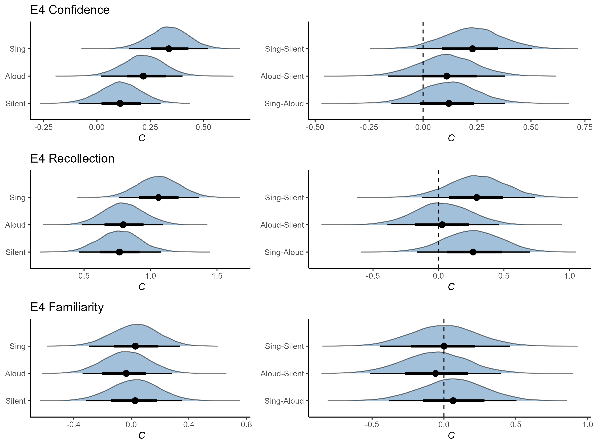

===============
Introduction to Bayesian Parameter Estimation
===============

This tutorial uses the following _R_ packages:

```R
library(tidyverse)
library(BayesFactor)
library(brms)
library(tidybayes)
```
---
Why use parameter estimation?
---

Bayes Factors are an intuitive and easily interpretable alternative to null hypothesis significance testing. However,
these ratios do not necessarily provide a complete picture of our beliefs. To demonstrate this, let's work through an example
using the built-in `sleep` dataset.

First, we assign the built-in dataset to a variable so we can modify it and recover the original if necesssary:

```R
d <- sleep
```

Next, let's conduct a Bayes Factor t-test using the `ttestBF` function from the `BayesFactor` package. For this example, we'll compare the extra hours
of sleep that each condition receieved. Note that this paired data, despite the fact that the condition variable is named `group`.

```R
ttestBF(d[d$group == 1,]$extra,
        d[d$group == 2,]$extra,
        paired = TRUE,
        data = d)
```

Output:

```R
Bayes factor analysis
--------------
[1] Alt., r=0.707 : 17.25888 ±0%

Against denominator:
  Null, mu = 0 
---
Bayes factor type: BFoneSample, JZS
```

According to our trusty rules of thumb, the evidence here is pretty solid. But where exactly do we derive this from? 
It might help to know what the posterior actually looks like. Let's repeat this test, but this time we'll generate a posterior
distribution and save it as a variable. For the purposes of this example, we'll draw 10000 samples from the posterior. Because 
sampling from the posterior is an iterative process, the samples drawn will vary slightly everytime this test is repeated, even if
we are working with the exact same dataset. To ensure we all get the exact same values, I include a call to `set.seed()` before
running the test.

```R
set.seed(999)

sleep.post <- ttestBF(d[d$group == 1,]$extra,
                     d[d$group == 2,]$extra,
                     paired = TRUE,
                     posterior = TRUE,
                     iterations = 1e5,
                     data = d)
```

We've successfully saved our posterior in the `sleep.post` variable. Let's take a look at it:

```R
head(supp.post)
```

Output:

```R
Markov Chain Monte Carlo (MCMC) output:
Start = 1 
End = 7 
Thinning interval = 1 
            mu      sig2      delta         g
[1,] -1.630122 2.9337786 -0.9517138 0.1575195
[2,] -1.206233 1.5606834 -0.9655476 0.5256748
[3,] -1.861915 1.8127548 -1.3828983 4.7538352
[4,] -1.474748 0.9622143 -1.5034260 0.6653339
[5,] -1.049121 1.3211610 -0.9127415 1.7021058
[6,] -1.265170 1.8386865 -0.9330288 5.1908654
[7,] -1.277349 2.6216533 -0.7889002 0.8153779
```

There's a lot going on there. For the purposes of this tutorial, we're going to ignore most of it. The parameter
of interest to is `mu`, which reflects the unstandardized difference in `extra` between conditions.  This reflects posterior samples - 10000 of them, 
to be precise - for the unstandardized difference in `extra` between conditions. That might sound somewhat absract - what does it _mean_?. To make it concrete, let's visualize the distribution of our posterior using `ggplot2`:

```R

```



